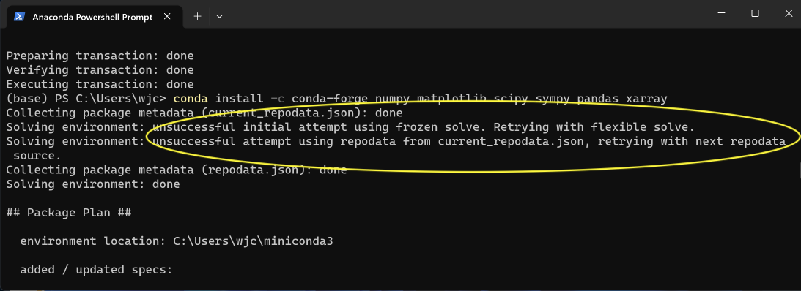
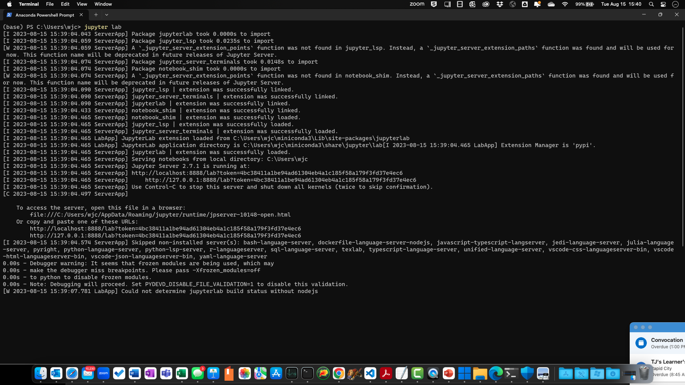
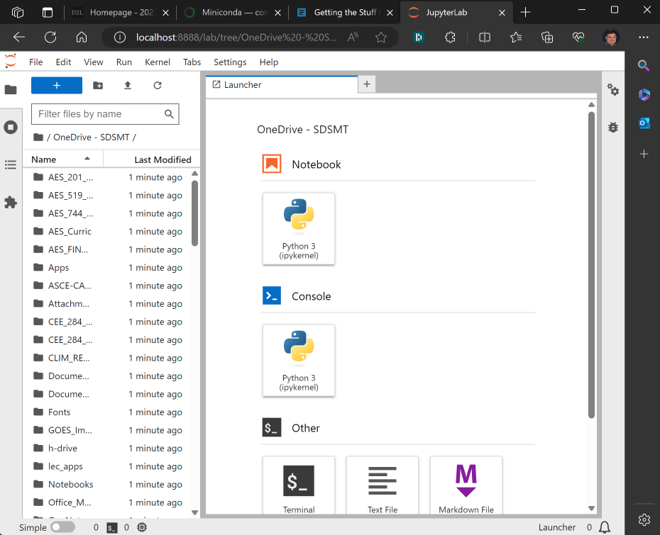

# Getting the Stuff to Get Started


```note
Looking for Mathcad Prime Instructions?  Click [here](https://support.sdsmt.edu/TDClient/30/Portal/KB/ArticleDet?ID=58)!  Regardless of what the instructions say, always install the latest edition.
```

```warning
Installing Python can take a while.  Much of it is spent letting the package manager search for available package versions that will not conflict with other installed packages.  Be Patient.
```

## 1 Installing Miniforge/Miniconda

```note
If you have Anaconda or Miniconda already installed from other classwork and aren't going to put much on it (i.e., if you are in CEE 284), you are probably fine and can move on to the next steps where you installing packages  If you are in an Atmospheric Sci class or upper-level science class you may want to remove Anaconda for Miniforge.  Consult with your professor for proper guidance.
```

I am recommending that you use "Miniforge" for this step.  Miniforge is a "slimmed down" version of the larger Anaconda package many people recommend. My experience is that the overhead for Anaconda makes for lots of problems later. The landing page to get Miniforge installed on Windows or MacOS is here:     

*  [https://conda-forge.org/download/](https://conda-forge.org/download/)


## 2 Adding and Locking-down Conda-Forge as your designated channel

Also, I am recommending that you work mostly through the conda-forge community.  Again, this provides more consistency in many of the packages you'll be working with. There are scores of repository areas (or "channels" in the conda community). Consequently, it is easy to accidentally get a package that was written by Frank that relies on a package written by Susan, which (naturally) is reliant on one developed by Pat.  The result can be a web of dependencies that may eventually conflict once you install "that one package."  Therefore we will stick with conda-forge as the "go-to" channel to get your packages.  From my experience, it's provided the least amount of misery.  

TL;DR: Pick a butchershop you can trust, and stick with 'em.  


```warning
We are now recommending that you use Miniforge over Miniconda or Anaconda.  

There is one noticable user difference between the three: the "Console" that you will need to use if you are on a Windows machine.  

Miniconda/Anaconda will have their "Anaconda/Miniconda prompt [or console or shell]" under the Window's Start Menu in the "Anaconda" or "Anaconda (miniconda 3)" window.  In the instructions below when you are asked to open a "console" use that.

Likewise there is a seperate console for Miniforge under the "Ms" iseparate console for Miniforge under the "M's" in the Start Menu called "Minoforge prompt."  This will be *your* "console."

Any of these options will have the same functionality.
```

To enable conda-forge, you should open a "Console" "shell".

*  In Unix or MacOS, it's just a Terminal window.
*  In Windows, you can find an "Console" under your "apps" from the "Start Menu."  That will launch you into a conda-friendly (but Spartan) operating system environment.  While you are doing that, this would be a good time to "pin" which Console you are using to the Start Menu with the traditional windows right-click.

If your Console has a "(base)" at the user prompt, you are ready to go!

Once you have an open working Console, enter the following commands one line at a time.  **You will be prompted to proceed on each step so don't drop the entire command blocks shown below.**

Just copy and paste each line one at a time.  Don't copy/paste multiple lines at once.


```
conda config --add channels conda-forge
conda config --set channel_priority strict
```
With this, you should have your "channel" locked in.  ("Miniforge" does this automatically but do the commands anyway.)

Now run an update to set this channel's packages as *your* packages.  There will be a LOT of them.  Approve these changes.  This will create a consistent distribution of packages that should be less likely to conflict with one another.

```
conda update -c conda-forge --all
conda update -c conda-forge conda
```

## 3 Loading some Libraries.

### 3.1 Commonly-Used Libraries

I recommend that, at this point, you load several libraries and packages.

First, you will need the Jupyter Resource packages to run the Jupyter notebooks.

* [Jupyter Notebooks, and JupyterLab](https://jupyter.org) and [IPython](https://ipython.org) environments
  * These are the Jupyter, JupyterLab, and notebook packages.  This will also include the IPython interactive Python environment

Then you can install (or reinstall) the following basic "must-have" packages for working in data science.

* [NumPy](https://numpy.org) The go-to package for basic math, array, and matrix handling with Python
* [Matplotlib](https://matplotlib.org) The go-to package for graphics and plotting in Python
* [SciPy](https://www.scipy.org) A library used for scientific computing and technical computing
* [Pandas](https://pandas.pydata.org) A package commonly used for working with tabular data as well as time series data
* [SymPy](https://www.sympy.org/en/index.html) A symbolic algebraic solver engine for Python
* [Scikit-Learn](https://scikit-learn.org/stable/) An open-source set of libraries for regressions, cluster analyses, and similar "machine-learning" activities.
* [xarray](http://xarray.pydata.org/en/stable/) Data manipulation and archiving of multi-dimensional datasets
* [seaborn](https://seaborn.pydata.org) An extension to Matplotlib for graph customization and more fancy graphics (often tied to statistical-type graphs.
* [openpyxl](https://openpyxl.readthedocs.io/en/stable/) A Python library to read/write Excel 2010 xlsx/xlsm files
* [pyreadr](https://github.com/ofajardo/pyreadr#pyreadr) A Package to read and write R RData and Rds files into/from pandas data frames
* [itables](https://mwouts.github.io/itables/quick_start.html) If you use Pandas in a Juptyer Notebook this is a must-have for working with large DataFrames.  It provides the same functional table rendering in RStudio.
* [johnnydep](https://github.com/wimglenn/johnnydep): Look. I didn't name it.  But it is very useful in assessing dependancies of any given package and it comes in handy when conda-forge doesn't have a give package but you want to keep any dependancies inside of the conda-forge-verse!  ["johnny" is a scripting language & "dep" stands for dependancies] 
* [version_information](https://github.com/jrjohansson/version_information) A very handy tool by Robert Johansson for Jupyter Notebooks to record what packages and their versions were used to make your notebook.  Good for troubleshooting and documentation/replicability.

In your Console window, enter the following *one line at a time*:

```
conda install -c conda-forge numpy scipy scikit-learn
conda install -c conda-forge jupyterlab  
conda install -c conda-forge matplotlib sympy pandas xarray itables johnnydep
conda install -c conda-forge seaborn openpyxl pyreadr version_information
```

```warning
When installing with *conda* it will first try to reconcile all the packages so any given package doesn't have components that may "break" other packages.  This you may get a warning saying that the "solving environment" has failed and it's trying another set of requirements.

You may also experience a few iterations of "Solving Environment," as shown below.  The busier your distribution, the more likely this will happen.  At that point, it is also best to only install one package at a time rather than a bunch in one single command.

 
```


### 3.2 More specialized libraries (not needed for CEE 284 students, but students wanting to work in Atmospheric Sciences, Hydrology, Climate Science or will want some of these)

If you work in any hydrology, weather & climate groups, you will also want to install the following.

* Get the following mapping libraries
  * [Cartopy](https://scitools.org.uk/cartopy/docs/latest/) A basic geospatial processing library that will be essential for mapping
  * [Shapely](https://shapely.readthedocs.io/en/latest/) A support package to help manipulate geometric objects
  * [OWSLib](https://geopython.github.io/OWSLib) Access the Open Geoscience Consortium resources and services.  Lots of good mapping goodies to have.
  * [pyProj](https://pyproj4.github.io/pyproj/stable/) An interface for working with map projections
  * [geopandas](https://geopandas.org/en/stable/) Geospatial access that leverages Pandas's Dataframe style resources

* Get the following complex data and meteo data resources
  * [pint](https://pint.readthedocs.io/en/stable/) and [pint-xarray](https://pint-xarray.readthedocs.io/en/latest/) units support
  * [metpy](https://unidata.github.io/MetPy/latest/index.html) UCAR-Unidata tools for reading, viewing, and analyzing meteo data
  * [netCDF4](https://unidata.github.io/netcdf4-python/) UCAR-Unidata tools for NetCDF4 Support
  * [Siphon](https://unidata.github.io/siphon/latest/) UCAR-Unidata support for accessing remote meteo data
  * [pyGrib](https://jswhit.github.io/pygrib/) NOAA-ESRL tools for WMO Gridded Binary (GRIB 1/2) support
  * [cfGrib](https://github.com/ecmwf/cfgrib) ECMWF tools for WMO Gridded Binary (GRIB 1/2) support
  * [zarr](https://zarr.readthedocs.io/en/stable/)
  * [cftime](https://unidata.github.io/cftime/) UCAR-Unidata support for time data support (including 360-day, leap-year-free 365-day, and other quirky calendars that only a meteorologist would love because the rest of the world are monsters)
  * [cf-python](https://ncas-cms.github.io/cf-python/) an Earth science data analysis library that is built on a complete implementation of the CF data model
  * [cf-plot](http://ajheaps.github.io/cf-plot) is a set of Python routines for making the common contour, vector, and line plots that climate researchers use
  * [cf-units](https://cf-units.readthedocs.io/en/latest/) Provision of a wrapper class to support Unidata/UCAR UDUNITS-2, and the cftime calendar functionality
  * [cf_xarray](https://cf-xarray.readthedocs.io/en/latest/) cf_xarray mainly provides an accessor that allows you to interpret Climate and Forecast metadata convention attributes present on xarray object
  * [timezonefinder](https://timezonefinder.readthedocs.io/en/latest/) useful for converting from civilized UTC time to more vulgar local times (including "daylight-'savings'" time).
  * [pytz](http://pytz.sourceforge.net) further support for time zones
  * [haversine](https://github.com/mapado/haversine) Calculate the distance (in various units) between two points on Earth using their latitude and longitude.
  * [wrf-python](https://wrf-python.readthedocs.io/en/latest/) A collection of diagnostic and interpolation routines for use with output from the Weather Research and Forecasting (WRF-ARW) Model.
  * [iris](https://scitools-iris.readthedocs.io/en/stable/) A powerful, format-agnostic, community-driven Python package for analyzing and visualizing Earth science data
  * [geocat-comp](https://geocat-comp.readthedocs.io/en/stable/) GeoCAT-comp provides implementations of computational functions for operating on geosciences data
  * [geocat-viz](https://geocat-viz.readthedocs.io/en/latest/index.html) The GeoCAT-viz repo contains tools to help plot data, including convenience and plotting functions that are used to facilitate plotting geosciences data with Matplotlib, Cartopy, and possibly other Python ecosystem plotting packages
  * [uxarray](https://uxarray.readthedocs.io/en/latest/index.html) UXarray provides Xarray-styled functionality for working with unstructured grids built around the UGRID conventions
  * [airportsdata](https://github.com/mborsetti/airportsdata/blob/main/README.rst) working with meteo data?  Need to look up ICAO or IATA codes, stations and locations?  This is your package (this one is new to conda-forge - you had to load it with pip in the past) 
  * [arm_pyart](https://arm-doe.github.io/pyart/) The Python ARM Radar Toolkit, Py-ART, is a Python module containing a collection of weather radar algorithms and utilities.

```
conda install -c conda-forge shapely cartopy OWSLib pyproj geopandas
conda install -c conda-forge pint pint-xarray pint-pandas metpy netCDF4 zarr
conda install -c conda-forge siphon pygrib timezonefinder iris satpy airportsdata
conda install -c conda-forge cftime cfdm cf_xarray cf_pandas cf-units cfgrib
conda install -c conda-forge pytz haversine uxarray wrapt setuptools cython
conda install -c conda-forge geocat-comp geocat-viz arm_pyart
conda install -c conda-forge basemap-data basemap-data-hires 
```

```warning
WRF-Python will require additional steps to get it running in most environments until the package is updated for more recent versions of [python/numpy](https://github.com/NCAR/wrf-python/issues/237).  The biggest one at present is that you will need a new conda environment based on an older version of Python-3 ([Hat tip to Eric Salathé @ U. Washington](https://groups.google.com/a/ucar.edu/g/wrfpython-talk/c/QfZ_eEfTbDI)}.  If you need WRF-Python, see Dr. Capehart or Dr. French in person for guidance.
```

```
conda install -c conda-forge wrf-python 
```


## 4 "Let's Light This Candle!"

How we are ready to go.  To launch Jupyter, I recommend that you again open your Python "Console" from the start menu if it's not open already. Again, you can also "Pin" it to your "Start" for easy access along with Excel, Mathcad, etc.)

At the Console prompt, enter. 

```
jupyter lab
```

And then the fun starts...

### 4.1 Firing Up the Jupyter Service

... the first thing you will see is a flurry of activity in your shell window.  That's ok.  What is happening is that your laptop is creating a virtual web service.   



You will see a web browser tab opening (it may ask you for a specific browser, such as Edge, Chrome, Firefox, Mosaic...).  You'll have a web page called "localhost:8080" open up.  This is the pretend web service housing your Jupyter workspace for coding in Python. 



To the left, you will see what looks like a File Manager. (That's your Jupyter File Manager.)  To the right will be a workspace.  It will most likely have a "launcher" pave with apps to push or the last Juptyer Notebook you had open.  You'll also see a menu at the top and other toys around the webpage's perimeter.

### 4.2 A Place For Your ~Crap~ Stuff

Jupyter's framework expects your work area to hang off of your home Windows directory. Therefore, I recommend creating a good working directory for your Python development wherever you keep your class materials: in your Documents, Dropbox, One-Drive-SDSMT, Google Drive, or other drive access by mouse-clicking on the Jupyter File Manager Sub-Window from your home directory.  

And with that, congratulations!  You have a flexible work environment that allows you to code in Python (and other languages) and create a document that includes traditional word-processing text, pictures, tables, active code, output, graphs, tables, and other resources. This will allow you to create a truly replicable and shareable piece of work that you can share with colleagues or clients. 

### 5 Ways Forward

From here, I have a fast "spinup" tutorial that introduces you to the basic Markdown language for documenting Python and some basic skills (that's the next section below this one in the menu to the left).  Much of it is for students who join my workgroup who have yet to learn Python before this or need some practice to refresh their skills.  There is also a "Stupid Python Tricks" page for more advanced use.

Play Hard. Have Fun.
