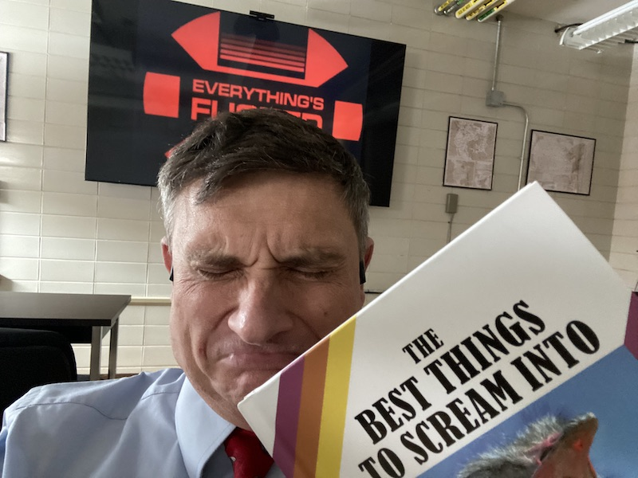

# Dr C's Python ~~Crying Fort~~ Support Pages

## About this Site

This page is a collection of "deep dives" that slowly work through basic issues on spinning up Python for beginners.  It covers the basics of getting started with Python in a Jupyter Notebook and emphasizes things that made me want to rage-quit in my transition to Python.  Consequently, a lot of the material here is slightly cheeky (and sometimes not-so cheeky).

This differs from many tutorial sites and "example" pages out there as my demos presented here slooowwwwwllllyy build the activity step-by-step adding small modifications one element at a time.  (In my experience being flooded with everything at once has led to me having to close my door for the benefit of my neighboring colleagues.)

## "Where would Dr Capehart go?"  

If you want to see where I went for my general Python training, it's this site right here.  This presumes a strong comfort in programming in general and some basic Python literacy.

*  [Jake Vanderplas's Python Data Science Handbook](https://jakevdp.github.io/PythonDataScienceHandbook/)

However, the PDSH does not include things like mapping, working with XArray, MetPy, or other specialized applications.

For those, I tend to mostly JFGIing it or holding my breath and diving into Stack Overflow.  

## Contact Information

[Dr. Bill Capehart](https://wjcapehart.github.io/Capehart_Research_Page/), Director, Atmospheric and Environmental Sciences 
Civil & Environmental Engineering 
South Dakota Mines 
501 E. Saint Joseph St.  Rapid City, SD 57701 
605.394.2439 | <a href="mailto:{{ site.email | encode_email }}" title="Contact me">Email me</a>

<a href="https://orcid.org/0000-0002-4926-0992"> 
 <!--- 
0000-0002-4926-0992---></a>
                    &nbsp;&nbsp;&nbsp;&nbsp;
<a href="https://www.sdsmt.edu/about/directory/capehart_william.html">

</a>
                    &nbsp;&nbsp;&nbsp;&nbsp;
<a href="https://www.linkedin.com/in/william-capehart/"><i style="font-size:24px" color="#0f4fb5" class="fa">&#xf08c;</i></a>
                    &nbsp;&nbsp;&nbsp;&nbsp;
<a href="https://github.com/wjcapehart"><i style="font-size:24px" class="fa">&#xf09b;</i></a>
                    &nbsp;&nbsp;&nbsp;&nbsp;
<a href="https://bsky.app/profile/billcapehart.bsky.social">

</a>
                    &nbsp;&nbsp;&nbsp;&nbsp;
<a href="https://x.com/Bill_Capehart"><i style="font-size:24px" class="fa">&#xf099;</i></a>
                    &nbsp;&nbsp;&nbsp;&nbsp;
<a href="https://www.facebook.com/william.capehart/"><i style="font-size:24px" class="fa">&#xf230;</i></a>
